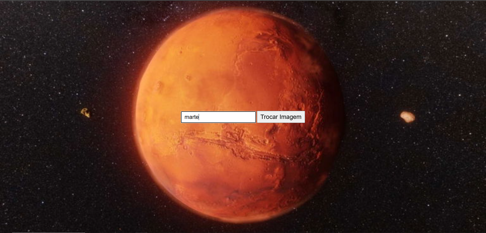

# **Projeto Troca de Imagens - Planetas**  

  

---

## **Sobre o Projeto**  

O objetivo deste projeto é aplicar os conhecimentos adquiridos em **HTML, CSS e principalmente JavaScript**, permitindo a troca dinâmica de imagens de planetas com base no nome digitado pelo usuário ou de forma aleatória ao clicar no botão.  

Este projeto faz parte das atividades do curso **Técnico em Desenvolvimento** do [SENAI Jandira](https://sp.senai.br/unidade/jandira/).  

---

## **Funcionalidades**  

- O usuário pode digitar o nome de um planeta e pressionar **Enter** para alterar a imagem de fundo.  
- Ao clicar no botão, a imagem muda aleatoriamente para um dos planetas disponíveis.  
- Suporte a diferentes formatos de imagem (`.jpg`, `.png`, `.webp`).  
- Interface simples e responsiva.  

---

## **Tecnologias Utilizadas**  

- HTML  
- CSS  
- JavaScript  
- Git  
- Markdown  

---

## **Autor**  

- [Kaike Bueno](https://www.linkedin.com/in/kaike-bueno-3b10a82b1/)  
